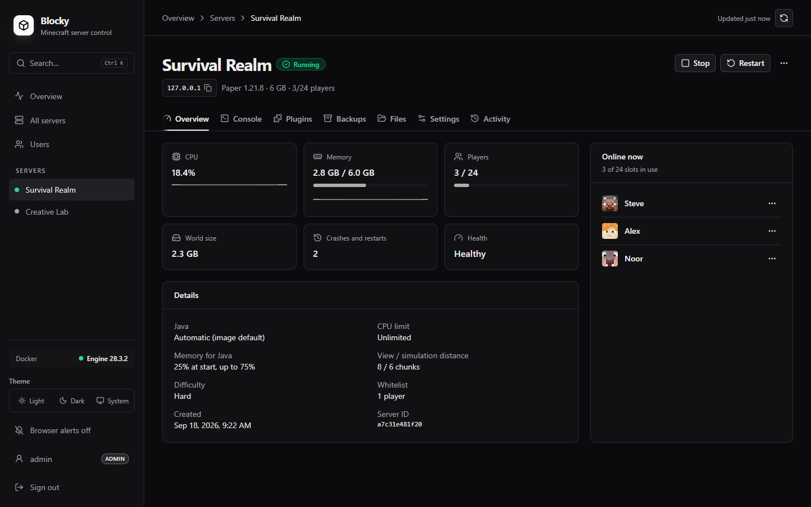

# Blocky Panel

A self-hosted control panel for Minecraft servers on Docker, built on [`itzg/minecraft-server`](https://github.com/itzg/docker-minecraft-server). Accounts with roles, one-click plugins and mods from Modrinth, incremental backups, and a live console, set up with one Compose file.



## Features

- Create Paper, Purpur, Vanilla, Fabric, Quilt, Forge, and NeoForge servers with isolated persistent storage
- Search Modrinth and install plugins (Paper, Purpur) or mods (Fabric, Quilt, Forge, NeoForge) with a click; the image downloads matching versions and required dependencies on start and updates them on every restart
- Choose the Java runtime per server, and cap memory and CPU per container
- Edit version, memory, port, difficulty, player limit, whitelist, seed, MOTD, and custom properties
- Tune heap percentages, view and simulation distance, log retention, shutdown warnings, idle pause, and modern JVM flags per server
- Start, stop, restart, inspect, and remove managed containers; reattach or delete the world data a removed server left behind
- Re-roll a Minecraft world: delete the overworld, Nether, and End and start fresh with a random or chosen seed, keeping plugins, mods, and settings
- Live console with command replies, history, quick commands, filtering, and player-name completion
- Online player list with kick, op, and whitelist actions; a copyable connect address for each server (set `BLOCKY_PUBLIC_HOST` to your domain)
- Create, download, restore, and delete incremental, deduplicated backups
- Scheduled backups with per-kind retention, retry backoff, weekly integrity checks, and offsite copies set up from the panel
- Browse, upload, edit, download, create, and delete files within each server's data directory
- Back up before updates and settings changes, verify health, and roll back automatically on failure
- Long operations (provisioning, updates, restores, backups) run in the background with live progress, and only one runs per server at a time
- Live CPU, memory, disk, player-count, health, and startup-failure visibility
- Persistent operation and restart history, with optional Discord/Slack webhook alerts on failures
- User accounts with Admin, Operator, and Viewer roles, invite links, password-reset links, and a sessions list you can sign out of
- Database-backed sessions (sign someone out and it takes effect immediately), login throttling, and cross-origin request protection
- Works on phones (bottom tab bar, full-height console), with dark mode, a Ctrl/Cmd+K command palette, and optional browser notifications
- Interactive demo mode that never touches Docker

## Run with Docker Compose

Blocky runs on any Linux machine with [Docker](https://docs.docker.com/engine/install/) (`curl -fsSL https://get.docker.com | sudo sh`). Everything, both the Compose files and the data, lives in one folder, `/opt/blocky-panel` by default:

```sh
sudo mkdir -p /opt/blocky-panel && cd /opt/blocky-panel
sudo curl -fsSLO https://raw.githubusercontent.com/teamdebris/blockypanel-app/main/compose.yaml
sudo curl -fsSL -o .env https://raw.githubusercontent.com/teamdebris/blockypanel-app/main/.env.example
# Edit .env and set BLOCKY_ADMIN_PASSWORD to a long random value (at least 16 characters):
#   openssl rand -base64 24
sudo docker compose up -d
```

The image is `ghcr.io/teamdebris/blockypanel-app`, built for amd64 and arm64. To update: `sudo docker compose pull && sudo docker compose up -d`. To stay on a release, set `BLOCKY_VERSION` in `.env` (for example `0.1.0`).

To keep it somewhere else, use that folder instead and set `BLOCKY_HOST_STORAGE` in `.env` to its absolute path (for example `/srv/minecraft`). The data can also live apart from the Compose files: point `BLOCKY_HOST_STORAGE` at any absolute path.

To build the image yourself, clone the repository and run `docker compose -f compose.yaml -f compose.build.yaml up -d --build`.

The panel only listens on `127.0.0.1:3000` by default. Put an HTTPS reverse proxy in front of it (see [Serve it over HTTPS](#serve-it-over-https)), or, on a trusted LAN or VPN only, set `BLOCKY_BIND_ADDRESS=0.0.0.0`.

Then open the panel. The first visit shows **Set up Blocky**, which asks for `BLOCKY_ADMIN_PASSWORD` (proof that you own the machine) and creates your admin account. Invite everyone else from **Users**.

## Serve it over HTTPS

Sign-in sends passwords and session cookies, so reach the panel over HTTPS (or only over a VPN).

### The bundled Caddy

If nothing else on the machine uses ports 80 and 443, Blocky can bring its own HTTPS. Point a domain at the machine, open ports 80 and 443, then in `/opt/blocky-panel`:

```sh
sudo curl -fsSLO https://raw.githubusercontent.com/teamdebris/blockypanel-app/main/compose.caddy.yaml
# In .env, uncomment and fill in:
#   COMPOSE_FILE=compose.yaml:compose.caddy.yaml
#   BLOCKY_DOMAIN=panel.example.com
sudo docker compose up -d
```

Caddy gets and renews the certificate by itself and keeps it in `caddy/`. With `COMPOSE_FILE` in `.env`, the usual `docker compose` commands (`pull`, `up -d`, `logs`) include it automatically. The overlay also turns on `BLOCKY_TRUST_PROXY` and `BLOCKY_COOKIE_SECURE`. Keep `BLOCKY_BIND_ADDRESS` at `127.0.0.1`, so Caddy stays the only way in.

### Your own reverse proxy

Already running Nginx Proxy Manager, Traefik, or Caddy? Point it at the panel, which is bound to `127.0.0.1` by default:

```env
BLOCKY_BIND_ADDRESS=127.0.0.1
BLOCKY_TRUST_PROXY=true
BLOCKY_COOKIE_SECURE=true
```

- `BLOCKY_TRUST_PROXY=true` makes login throttling use the address the proxy adds to `X-Forwarded-For` (the last entry), and origin checks use `X-Forwarded-Host`. Only turn it on when the proxy is the **only** way to reach port 3000; otherwise anyone could send those headers themselves.
- Cookies are also marked `Secure` automatically when the proxy sends `X-Forwarded-Proto: https`.

**Caddy** (gets and renews certificates by itself, and sets the forwarded headers):

```caddyfile
panel.example.com {
    reverse_proxy 127.0.0.1:3000
}
```

**nginx:**

```nginx
server {
    listen 443 ssl;
    server_name panel.example.com;
    ssl_certificate     /etc/letsencrypt/live/panel.example.com/fullchain.pem;
    ssl_certificate_key /etc/letsencrypt/live/panel.example.com/privkey.pem;

    location / {
        proxy_pass http://127.0.0.1:3000;
        proxy_set_header Host $host;
        proxy_set_header X-Forwarded-Host $host;
        proxy_set_header X-Forwarded-For $proxy_add_x_forwarded_for;
        proxy_set_header X-Forwarded-Proto $scheme;
        # The live console is a long-lived event stream.
        proxy_buffering off;
        proxy_read_timeout 1h;
    }
}
```

If the proxy runs in Docker instead, put it on the same Docker network as the panel, point it at `blocky-panel:3000`, and remove the `ports:` mapping from `compose.yaml` so port 3000 isn't published at all.

For extra protection against password guessing, you can rate-limit `/api/auth/` in the proxy (nginx `limit_req`, or a Caddy rate-limit plugin). The panel limits it too.

## Accounts and roles

| | Viewer | Operator | Admin |
|---|---|---|---|
| See servers, players, console output, backups, activity | ✓ | ✓ | ✓ |
| Start, stop, restart; send console commands; back up now; view settings | | ✓ | ✓ |
| Change settings, files, install plugins and mods, create/delete servers, restore/delete/download backups, users | | | ✓ |

- **Invites:** an admin picks a role and gets a one-time link (valid 24 hours). The person chooses their own username and password. Password resets work the same way, so admins never see anyone's password.
- **Operators get the full console**, including Minecraft's `op`. Only give it to people you'd trust with the server console.
- **Files are admin-only**, because `server.properties` holds the RCON password and downloads contain whole worlds.
- **Recovery:** if you forget your password, use "Locked out? Use recovery sign-in" on the login page with `BLOCKY_ADMIN_PASSWORD`. It gives a one-hour admin session and is recorded in the account activity log. Leave `BLOCKY_ADMIN_PASSWORD` empty to turn recovery off.
- Accounts live in `panel/panel.db` (SQLite). It isn't part of world backups; if it's lost, use recovery sign-in to set up again and re-invite people.
- The last admin can't be demoted, disabled, or deleted, and nobody can change their own role.

## Plugins and mods

Paper and Purpur servers get a **Plugins** tab, and Fabric, Quilt, Forge, and NeoForge servers a **Mods** tab. Search [Modrinth](https://modrinth.com), add what you want, and apply: the server restarts, and the image downloads versions that match the server's type and Minecraft version, plus any required dependencies, into `plugins/` or `mods/`. They update to the newest compatible release on every restart; removing one deletes its files on the next start. Jars added by hand (through Files) are listed separately and left alone.

Changing the server type or Minecraft version in Settings lists the plugins or mods that have no build for the new setup before you apply it.

## Backups

Incremental backups use restic, installed in the panel image. Each server has an encrypted repository and a generated password file in its backup directory. Every snapshot is a complete, independently restorable copy of the world. Restic splits files into chunks and stores each chunk once, so a new snapshot only writes chunks that changed and reuses the rest. Deleting any snapshot, including the oldest, never affects the others. Its unique data is reclaimed at the next daily prune. The backup list shows each snapshot's full world size and how much new data it stored when it was taken. Downloading a snapshot exports a full `.tar` for portability. Legacy `.tar` backups continue to appear in the backup list and can be restored or downloaded; delete them explicitly when they are no longer needed.

- **Retention** is applied per kind: scheduled and manual backups each keep the configured number, and the newest five safety snapshots (taken before updates, settings changes, and restores) are kept separately so they never push out scheduled history.
- **Scheduled backups never stop a running server.** If RCON is unavailable, the run fails, retries with backoff (15 minutes, 30, 1 hour, ... up to the interval), and alerts.
- **Maintenance:** unreferenced data is pruned once a day, and `restic check` runs weekly.

### Offsite backups

Admins set these up under **Offsite backups**, with no config files to edit. Pick where copies go:

- **Cloud storage:** Backblaze B2, Cloudflare R2, Wasabi, Amazon S3, MinIO, or any S3-compatible service. Enter the bucket and an access key that can only reach it.
- **Another disk:** a folder on this machine, like a second drive or a mounted network share (`/mnt/backup`). Blocky runs restic in a short-lived `restic/restic` container that mounts it, so Compose doesn't change.
- **SFTP / NAS:** a host, user, and folder. Sign in with a password, or with an SSH key the panel generates for you. The server's host key is pinned the first time you connect, and copying stops if it ever changes.

Then choose a **backup passphrase**. Everything is encrypted before it leaves the machine. After each backup (or once a day), Blocky copies what changed, one server at a time, with each server's settings. A server's Backups tab shows when it was last copied, and failures go to its activity log and the webhook.

**Disaster recovery.** On a new machine, install Blocky, open **Offsite backups → Restore from an offsite backup**, and enter the destination and your passphrase. Pick the servers to bring back. Each one is recreated with its settings, port, and newest world, then started, and the new panel carries on copying to the same place. You can also roll a single server back to any offsite copy from its Backups tab.

The passphrase can't be recovered: keep it in a password manager. It can be changed at any time (the old one stops working). For cloud storage, turn on object versioning or object lock at the provider, so even someone who takes over the panel can't erase older copies.

## Alerts

Set `BLOCKY_WEBHOOK_URL` to a Discord webhook (or any endpoint accepting `{"content": ..., "text": ...}`) to be notified when a scheduled backup fails, a server crashes, an operation fails, or a repository check fails.

## Storage layout

```text
/opt/blocky-panel/                   # BLOCKY_HOST_STORAGE
├── compose.yaml, .env               # your install (when the data lives next to it)
├── panel/panel.db                   # user accounts, sessions, and offsite backup settings (SQLite)
├── panel/control-state.json         # backup policies, schedule state, and operation history
├── panel/control-state.json.bak     # previous copy, used automatically if the main file is damaged
├── panel/cache/restic/              # restic metadata cache (safe to delete)
├── servers/<server-id>/data/        # world and saves (backed up)
├── servers/<server-id>/server.json  # saved configuration, used to reattach a removed server
├── backups/<server-id>/restic/      # deduplicated backups
├── backups/<server-id>/restic-password # required to restore incremental snapshots
└── caddy/                           # certificates, with the bundled Caddy only
```

Managed containers carry `panel.*` labels. Those labels are the panel's desired-state record, so the server list can be rebuilt directly from Docker without a separate database. `server.json` mirrors them so a world can be reattached after its container is removed.

## Security

The panel controls Docker, which is root-equivalent on the host, so treat admin accounts like root access. Keep the panel on `127.0.0.1` behind an HTTPS reverse proxy or a VPN, and only expose game ports publicly. [SECURITY.md](SECURITY.md) covers the security model and how to report a vulnerability.

Player avatars on the server overview load from `mc-heads.net`, which receives the names of online players.

RCON is enabled inside each Minecraft container because the image uses it for graceful shutdowns and saves. Blocky generates a random RCON password, doesn't publish the RCON port, and rejects custom properties that would disable or reconfigure it.

## Development

Prerequisites: Node.js 22.13+ and a running Docker Engine or Docker Desktop.

```powershell
npm install
npm run dev
```

Open [http://127.0.0.1:3000](http://127.0.0.1:3000) and create the first admin account. `npm run dev` listens on localhost only, because in development the setup page doesn't ask for `BLOCKY_ADMIN_PASSWORD` when none is set. To reach it from other devices on your network, set one first and use `dev:lan`, which refuses to start without it:

```powershell
$env:BLOCKY_ADMIN_PASSWORD='a-long-random-password'
npm run dev:lan
```

On Windows, Dockerode automatically connects to Docker Desktop's named pipe. On Linux and macOS, it uses the standard Docker socket.

To explore the interface without Docker:

```powershell
$env:BLOCKY_DEMO='true'
npm run dev
```

The demo state is in memory and resets when the development server restarts.

```sh
npm run dev      # local development (localhost only)
npm run dev:lan  # development on the network (requires BLOCKY_ADMIN_PASSWORD)
npm test         # unit tests
npm run lint     # ESLint
npm run build    # production build and type check
npm run start    # run the built application
```

Set `MINECRAFT_IMAGE` to pin a specific `itzg/minecraft-server` image tag; per-server Java versions use the matching `:javaNN` tag of the same repository. Running with Node directly, `BLOCKY_STORAGE` sets the data folder and `BLOCKY_DOCKER_STORAGE` the same folder as Docker sees it.

[docs/ARCHITECTURE.md](docs/ARCHITECTURE.md) explains how the code is organized, and what to run before a pull request.

## License

Blocky Panel is free software under the [GNU Affero General Public License v3.0](LICENSE). You can use it, including commercially, and modify it. If you modify it and let others use it over a network, you must make your modified source available to them under the same license.

## Not affiliated

Blocky is a community project. It isn't an official Minecraft product and isn't approved by or associated with Mojang or Microsoft.
