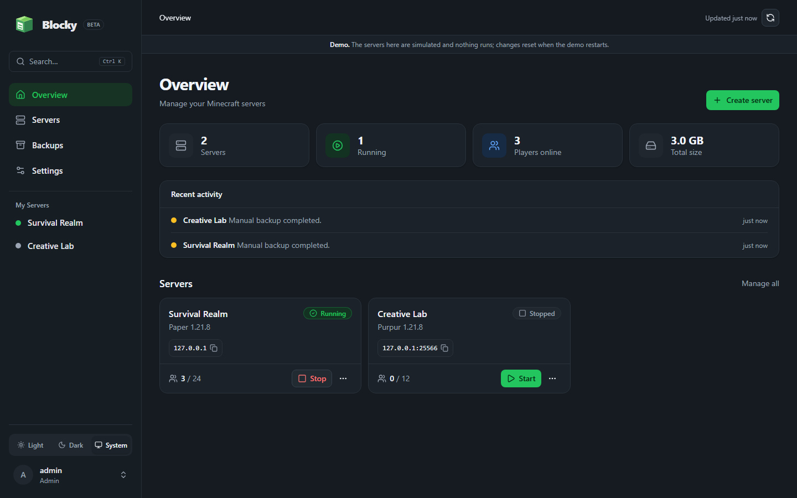

  <picture>
    <source media="(prefers-color-scheme: dark)" srcset="public/brand/blocky-panel-mark-dark.svg">
    
  </picture>

# Blocky Panel

A self-hosted web panel for running Minecraft servers with Docker.

> **Beta.** Blocky is young: expect rough edges and keep backups on. What it doesn't do yet is in [Known issues](docs/KNOWN-ISSUES.md).

- **Website:** [blockypanel.com](https://blockypanel.com)
- **Demo:** [demo.blockypanel.com](https://demo.blockypanel.com) (sign in as `admin` with the password `blocky-demo`; the servers are simulated)
- **Install:** the [installer on blockypanel.com](https://blockypanel.com/#install) builds the commands for your setup. Everything else is in the [guide](docs/GUIDE.md).

## Features

- Paper, Purpur, Vanilla, Fabric, Quilt, Forge, and NeoForge servers
- A live console with history and quick commands
- Plugins and mods from Modrinth, in one click
- A file manager and SFTP
- Scheduled restarts, commands, and chat messages
- Incremental backups with one-click restore, plus encrypted off-site copies
- Accounts with roles and two-factor sign-in
- Works on a phone, in light and dark
- Optional [Blocky Cloud](https://cloud.blockypanel.com): free `blockylink.net` addresses and Obsidian backups

## Built with

- [itzg/docker-minecraft-server](https://github.com/itzg/docker-minecraft-server): the container every Minecraft server runs in
- [restic](https://restic.net): incremental, encrypted backups and off-site copies
- [Caddy](https://caddyserver.com): automatic HTTPS for the optional domain setup

## AI assistance

Blocky Panel was built with AI assistance for code formatting, documentation writing, security audits, and UX/UI development. The models used were ChatGPT Sol 6, ChatGPT Astra 6, Claude Opus 4.8 and 5.5, and Claude Fable 5.1. Continuous testing during development was done by a meat-bag.

## License

[AGPL-3.0](LICENSE). Not affiliated with Mojang or Microsoft.
